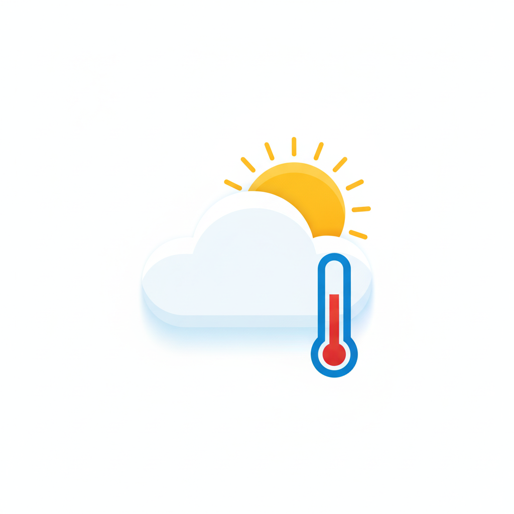

<p align="center">
  
</p>

<h1 align="center">☀️ Open-Meteo Custom pour Home Assistant</h1>

<p align="center">
  <a href="https://github.com/hacs/default"></a>
  <a href="https://github.com/SocrateMobile/open_meteo_custom/releases"></a>
  
</p>

Intégration météo et qualité de l'air haute performance pour Home Assistant, basée sur l'API gratuite Open-Meteo et le géocodage de la Base Adresse Nationale (BAN).

---

## ✨ Nouveautés v1.3.0

* 🛡️ **Résolution de l'erreur Recorder (16 384 octets)** : suppression des gros tableaux d'heures brutes dans les attributs d'état pour préserver la base de données Home Assistant.
* 🌿 **Plateforme Capteurs Dédiée (`sensor.py`)** : création de 13 entités capteurs natives pour la Qualité de l'Air (AQI Européen/US, PM2.5, PM10, NO2, Ozone), l'Indice UV, l'ensoleillement et les rafales de vent.
* 📍 **Multi-Localisation & Géocodage Universel** : configurez par Code Postal français, coordonnées GPS du domicile ou coordonnées manuelles.
* ⚙️ **Options en Direct (`OptionsFlow`)** : réglez l'intervalle de mise à jour (15 min, 30 min, 60 min) et activez/désactivez l'interrogation de la qualité de l'air sans réinstaller.
* 🏗️ **Architecture Moderne** : passage à `CoordinatorEntity` et intégration dans le registre d'appareils Home Assistant (`DeviceInfo`).

---

## 📊 Entités Fournies

### 1. Météo (`weather`)
* `weather.open_meteo_<lieu>` : météo actuelle + prévisions horaires et quotidiennes natives accessibles via `weather.get_forecasts`.

### 2. Capteurs Qualité de l'Air (`sensor`)
* **AQI Européen** (`sensor.open_meteo_<lieu>_qualite_de_l_air_aqi_europe`)
* **AQI US** (`sensor.open_meteo_<lieu>_qualite_de_l_air_aqi_us`)
* **Niveau Qualité de l'Air** (Bon, Moyen, Dégradé, Mauvais...)
* **Particules fines PM2.5** ($\mu g/m^3$)
* **Particules PM10** ($\mu g/m^3$)
* **Dioxyde d'azote NO2** ($\mu g/m^3$)
* **Ozone O3** ($\mu g/m^3$)

### 3. Capteurs Météo & Rayonnement (`sensor`)
* **Indice UV Actuel & UV Maximal du jour**
* **Ensoleillement du jour** (en heures)
* **Cumul de précipitations du jour** (en mm)
* **Rafales maximales du jour** (en km/h)
* **Chutes de neige du jour** (en cm)

---

## 🗄️ Gestion de la Rétention de l'Historique (Recorder)

Pour limiter l'historique de votre base de données à 1 mois (30 jours) et optimiser les performances de Home Assistant, ajoutez cette directive dans votre fichier `/config/configuration.yaml` :

```yaml
recorder:
  purge_keep_days: 30
  auto_purge: true
```

---

## 🛠️ Installation

### Via HACS (Recommandé)
1. Ouvrez HACS dans Home Assistant.
2. Cliquez sur les 3 points en haut à droite > **Dépôts personnalisés**.
3. Ajoutez l'URL : `https://github.com/SocrateMobile/open_meteo_custom` avec la catégorie **Intégration**.
4. Téléchargez et redémarrez Home Assistant.

### Installation Manuelle
1. Téléchargez la dernière release `open_meteo_custom-v1.3.0.zip`.
2. Décompressez le dossier `open_meteo_custom` dans `/config/custom_components/open_meteo_custom/`.
3. Redémarrez Home Assistant.

---

## ⚙️ Configuration

1. Rendez-vous dans **Paramètres > Appareils et Services > Ajouter une intégration**.
2. Recherchez **Open-Meteo Custom**.
3. Choisissez votre mode de localisation :
   - **Code Postal (France)** : géocodage automatique de la commune.
   - **Coordonnées Home Assistant** : coordonnées GPS de votre domicile.
   - **Coordonnées Manuelles** : saisie libre latitude / longitude.
